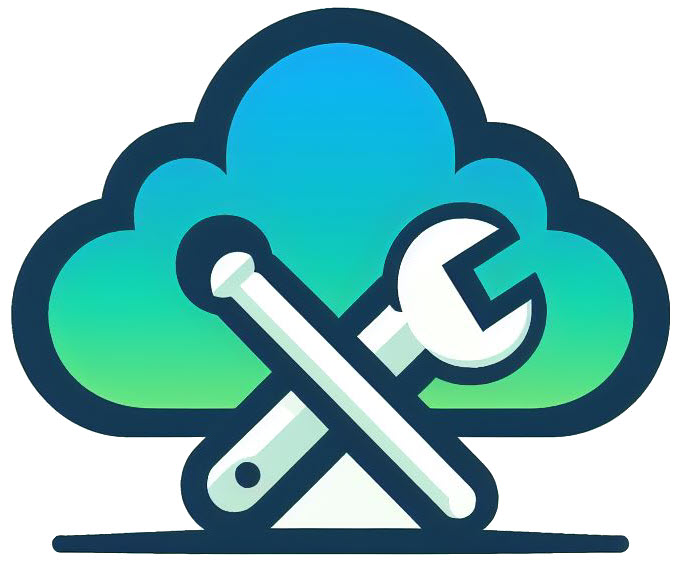

<h1 align="center">
  
  <br>
  Azure SRE Agent Demo
  <br>
</h1>

## Prerequisites
- [Azure Subscription](https://azure.microsoft.com/free/)
- Preview Access: [Azure SRE Agent application](https://go.microsoft.com/fwlink/?linkid=2319540)

## :rocket: Getting Started
- Create SRE Agent: [Create and Use an agent in Azure SRE Agent Preview](https://learn.microsoft.com/en-us/azure/sre-agent/usage)

## 🧪 Failure Simulation Scenarios

This repository includes 5 Kubernetes manifests to simulate common failure scenarios for testing Azure SRE Agent monitoring and alerting capabilities with Private AKS Clusters.

### Available Scenarios

#### 1. CrashLoopBackOff (`k8s/crashloop-failure.yaml`)
**Description:** Simulates an application that continuously crashes and restarts.

**Expected SRE Agent Detection:**
- Pod restart count increasing
- Container exit codes (exit 1)
- Continuous restart patterns

**Deploy:**
```bash
kubectl apply -f k8s/crashloop-failure.yaml
```

**Cleanup:**
```bash
kubectl delete -f k8s/crashloop-failure.yaml
```

---

#### 2. OOMKilled (`k8s/oom-failure.yaml`)
**Description:** Simulates a container exceeding its memory limits, triggering OOMKilled termination.

**Expected SRE Agent Detection:**
- Memory threshold breach alerts
- OOMKilled termination reason
- Resource exhaustion warnings

**Deploy:**
```bash
kubectl apply -f k8s/oom-failure.yaml
```

**Cleanup:**
```bash
kubectl delete -f k8s/oom-failure.yaml
```

---

#### 3. ImagePullBackOff (`k8s/imagepull-failure.yaml`)
**Description:** Simulates a deployment referencing a non-existent container image.

**Expected SRE Agent Detection:**
- Image pull errors
- Deployment not ready
- Failed to pull image events

**Deploy:**
```bash
kubectl apply -f k8s/imagepull-failure.yaml
```

**Cleanup:**
```bash
kubectl delete -f k8s/imagepull-failure.yaml
```

---

#### 4. Liveness Probe Failure (`k8s/liveness-failure.yaml`)
**Description:** Simulates an application that becomes unhealthy after 30 seconds and fails health checks.

**Expected SRE Agent Detection:**
- Health check failures
- Pod restarts due to failed liveness probes
- Container restart events

**Deploy:**
```bash
kubectl apply -f k8s/liveness-failure.yaml
```

**Cleanup:**
```bash
kubectl delete -f k8s/liveness-failure.yaml
```

---

#### 5. Pending Pod (`k8s/pending-failure.yaml`)
**Description:** Simulates a pod that cannot be scheduled due to excessive resource requests (50 CPUs, 100Gi memory - exceeds cluster capacity).

**Expected SRE Agent Detection:**
- Unschedulable pods
- Insufficient resources events
- Resource pressure alerts

**Deploy:**
```bash
kubectl apply -f k8s/pending-failure.yaml
```

**Cleanup:**
```bash
kubectl delete -f k8s/pending-failure.yaml
```

---

### Deploy All Scenarios
```bash
kubectl apply -f k8s/crashloop-failure.yaml \
              -f k8s/oom-failure.yaml \
              -f k8s/imagepull-failure.yaml \
              -f k8s/liveness-failure.yaml \
              -f k8s/pending-failure.yaml
```

### Cleanup All Scenarios
```bash
kubectl delete -f k8s/crashloop-failure.yaml \
               -f k8s/oom-failure.yaml \
               -f k8s/imagepull-failure.yaml \
               -f k8s/liveness-failure.yaml \
               -f k8s/pending-failure.yaml
```

### Target Cluster Configuration
These scenarios are designed for testing with a Private AKS cluster configured with:
- **Network Plugin:** Azure CNI (Overlay mode) with Cilium
- **Network Policy:** Cilium
- **Node Count:** 3 nodes (autoscale 2-3)
- **Node Size:** Standard_D4ads_v6 (4 vCPUs, 16 GB RAM per node)
- **Total Capacity:** ~12 vCPUs, ~48GB RAM
- **Zones:** 1, 2, 3
- **Monitoring:** Azure Monitor Metrics + Managed Grafana

## :wave: Contributors
- [Eric Leonard](https://github.com/erleonard)

## :warning:  License

This repository is licensed under the MIT license. See the [LICENSE](LICENSE) file for more information.